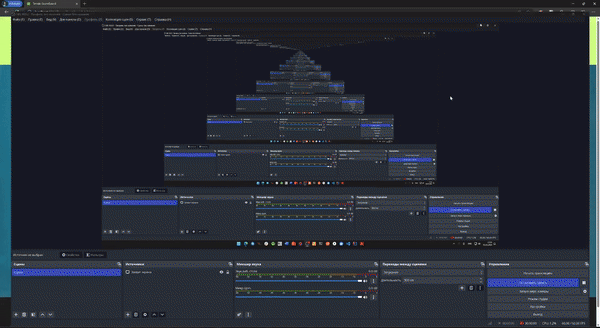

# Tennis Scoreboard

## Description

`Tennis Scoreboard` - It is MVC Java Servlet App with Unit tests for testing score point in each game.
It has a view with jsp pages you can start game and look at finished games.

Project from this [course](https://zhukovsd.github.io/java-backend-learning-course/)

## Project Stack

* Servlets
* Java EE
* Docker
* Docker compose
* H2
* Slf4j
* JUnit 5
* Hibernate
* Criteria API
* JSP

## Program in action  

## The rules I followed

* One score 15 point after 30 point it is 10 point 
* When score is 40 40 it enables advantage. When first player scores AD 40 and if second scores it is 40 40 to win you have to score two point in row
* When games are 6 6 it enables tie break. Players play till 7 point or you have to win in two point advantage for example 9 7
* Best of 3

## Pages of project

### Main page

### New Match

### Match in progress

### Matches

